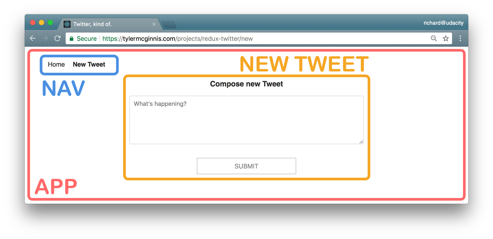
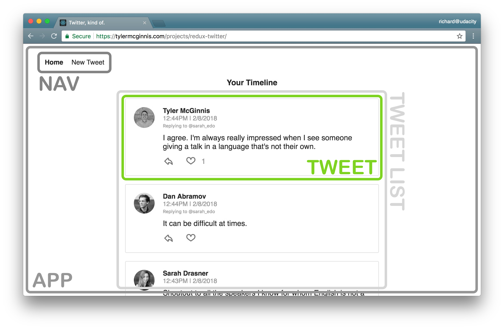
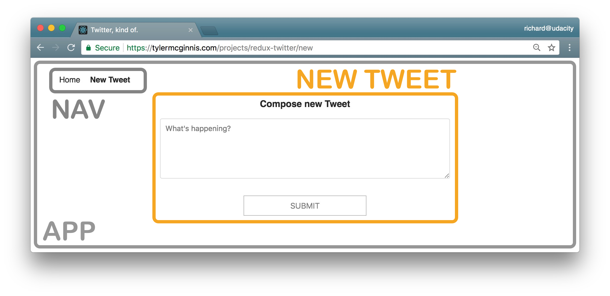

# Real World Redux

## Plan App's Architecture
1. Identify what each view should look like
2. Break each view into a hierarchy of components
3. Determine what events happen in the app
4. Determine what data lives in the store

## Step 1 - identify each view

Click to expand

### View for the dashboard page

- is located at the home route (`/`)
- shows tweets sorted from most recently added at the top, to oldest at the bottom
- each tweet will show:
  - the author
  - the time stamp
  - who the author is replying to
  - the text of the tweet
  - a reply button - with the number of replies (if higher than 0)
  - a like button - with the number of likes (if higher than 0)

### View for the tweet page

- is located at `/tweet/:id`
- shows an individual tweet
  - the author
  - the time stamp
  - a reply button - with the number of replies (if higher than 0)
  - a like button - with the number of likes (if higher than 0)
- has a reply form
- shows all replies

### View for creating a new tweet

- is located at `/new`
- has a textbox for adding a new tweet

## Step 2 - break each view into a hierarchy of components

Click to expand

### Components for the dashboard view

- App - the overall container for the project
- Navigation - displays the navigation
- Tweets List - responsible for the entire list of tweets
- Tweet - in charge of display the content for a single tweet

### Components for the tweet view

- App - the overall container for the project
- Navigation - displays the navigation
- Tweet Container - displays a list of tweets
- Tweet - displays the content for a single tweet
- New Tweet - display the form to create a new tweet (reply)

### Components for the new tweet view

- App - the overall container for the project
- Navigation - displays the navigation
- New Tweet - display the form to create a new tweet

### All components
- App
- Navigation
- Tweets List
- Tweet Container
- Tweet
- New Tweet

## Step 3 - determine what events happen in the app

Click to expand

### Tweets list component

- *get* the **tweets**

### Tweet container component

- *get* a specific tweet from a list of **tweets**
- *get* the replies to a specific tweet from a list of **tweets**

### Tweet component

- *get* a particular tweet from a list of **tweets**
- *get* the **authedUser** (user that is currently logged in) so the user can *toggle* the likes on each **tweet**
- *get* the **authedUser** so the user can *reply* to a **tweet**

### New tweet component

- *get* the **authedUser** so the user can *create* a new **tweet**
- *set* the **text of the new tweet**

## Step 4 - determine what data lives in the store

Click to expand

